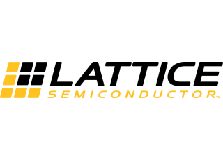
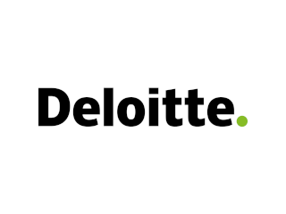
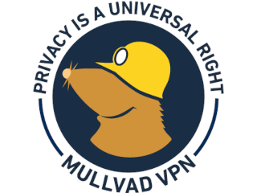
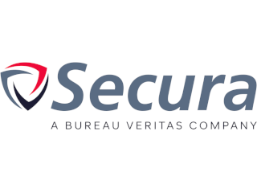
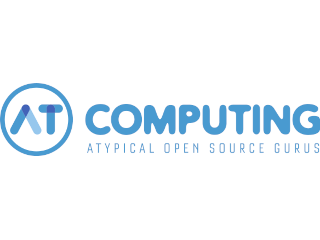
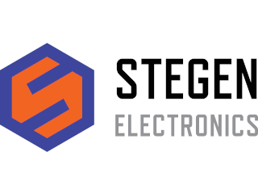

As shown on every delivered MCH2022 badge at first boot

## MCH2022 Badge Sponsors

  
  
  
  
  
  &emsp;&emsp;&emsp;&emsp;&emsp;&emsp;&emsp;&emsp;&emsp;&emsp;

* **ALLNET China** was our production partner, for which we are more than grateful. They took care of sourcing most components and oversaw the production process [in China][ALLNET China], saving us a lot of work and potential headaches and allowing us to focus on the product!
* **Espressif** was very generous to donate us all of the [ESP32-WROVER-E][ESP32] modules we needed. The ESP32 has proven itself to be a solid basis for badges in the past, and for related projects such as the [PocketSprite]. Espressifs continued support means a lot to us as it allows us to continue expanding our existing ESP32-based ecosystem!
* **Lattice Semiconductor** provided us with 4000 pieces of their awesome [ICE40UP5K] low-power FPGA. With this donation, they enabled us to explore and provide a new dimension of hardware capabilities and user-created applications. We shipped the first FPGA-equipped event badge in the world. Thanks Lattice!
* **Bosch Sensortec** let us put two of their advanced sensors on the badge: the [BNO055] 9-axis Absolute Orientation Sensor, and their new [BME680] Air-Quality (And More) Sensor. These sensors enable a range of uses for the badge off-the-shelf, allowing developers to develop more engaging games and expanding the range of potential uses for the badge after the event.
* The **Raspberry Pi Foundation** helped us out with a discount when another chip which we tried to source became unavailable. On the badge, the [RP2040] enables a wide range of USB capabilities, allowing us to work on [bridging the gap][Badge IDE] between embedded development and everyday computing.

All of our sponsors helped us out in a time when sourcing capable chips was a near-impossible task. Without them, this project would not have been possible. We are grateful to all of them for their help and sponsorship, and we hope to work with them again in future badge projects!

[ALLNET China]: https://www.allnet.de/en/allnet-brand/unternehmen/weltweit/
[ESP32]: https://www.espressif.com/en/products/modules/esp32
[PocketSprite]: https://pocketsprite.com
[ICE40UP5K]: https://www.latticesemi.com/en/Products/FPGAandCPLD/iCE40UltraPlus
[BNO055]: https://www.bosch-sensortec.com/products/smart-sensors/bno055/
[BME680]: https://www.bosch-sensortec.com/products/environmental-sensors/gas-sensors/bme680/
[RP2040]: https://www.raspberrypi.com/products/rp2040/
[Badge IDE]: https://github.com/badgeteam/mch2022-webusb-site

Of course, MCH2022 and the badge project would not have been possible without all of the event's sponsors:

## MCH2022 Platinum Sponsors

  
  
  
  &emsp;&emsp;&emsp;&emsp;&emsp;&emsp;&emsp;&emsp;&emsp;&emsp;

## MCH2022 Gold Sponsors

  
  
  
  
  
  &emsp;&emsp;&emsp;&emsp;&emsp;&emsp;&emsp;&emsp;&emsp;&emsp;

## MCH2022 Silver Sponsors

  
  
  
  
  
  &emsp;&emsp;&emsp;&emsp;&emsp;&emsp;&emsp;&emsp;&emsp;&emsp;&emsp;&emsp;&emsp;&emsp;
   
  
  
  
  
  
  &emsp;&emsp;&emsp;&emsp;&emsp;&emsp;&emsp;&emsp;&emsp;&emsp;&emsp;&emsp;&emsp;&emsp;

